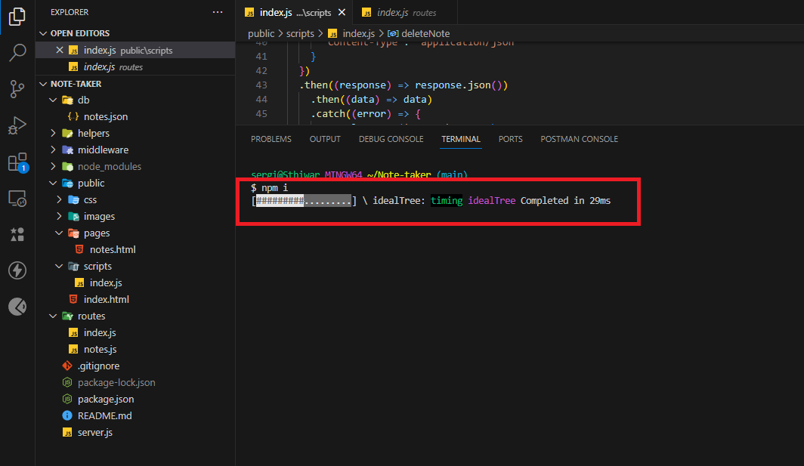
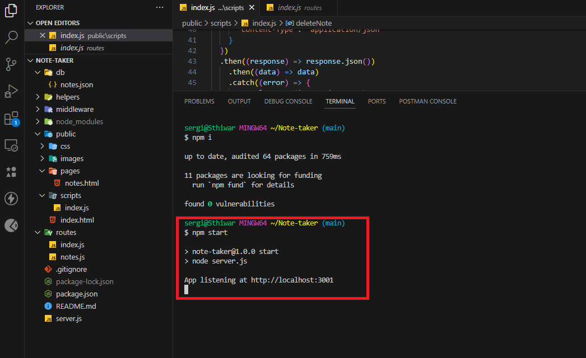

# NoteMaster

## Description  :bookmark_tabs:
The motivation behind creating NoteMaster was to address the need for a simple and efficient way to organize and manage notes. As a busy developer/individual, keeping track of ideas, tasks, and important information can be challenging. NoteMaster provides a convenient solution for capturing, storing, and accessing notes from any device with an internet connection. NoteMaster solves the problem of scattered notes and disorganized information by offering a centralized platform for note-taking. Users can easily create new notes and delete them if they do not need them anymore. 
Creating NoteMaster was a total challenge for the reason that I wasn't really sure how express works (or implement it) but there is no doubt that it was a valuable learning experience that allowed me to deepen my understanding of web development, particularly in the areas of front-end and back-end integration. Through this project, I gained hands-on experience with JavaScript, express.js and node.js plus a bit more understanding of Bootstrap. I also learned how to interact with a server-side API to store and retrieve data, improving my skills in asynchronous JavaScript and HTTP requests.
## Installation :computer:

You are able to check this app by two ways:

 1. If you want to check my app, you can go to this URL: 
 2. If you want to try it yourself, you have to have "Node.js" installed in your computer, then you have to clone my repository and run it locally.

## Usage :bar_chart:

If you want to try the app yourself make sure you have "Node.js" in your computer, and do not forget to run the next lines of code before opening the app:
    
    npm i

 
 
 ---
After that run one of the next lines:

    npm start

 
 ---
Either you open the app locally or throw my deployed application, you will see the homepage first:

 
 ---
After clicking "Get Started" you can start typing your note and a description to it.

 
 ---
Then you can show it on the left side and you can delete it anytime you want. Enjoy it!

 
 ---

## Credits :email:

List of all the links that made me succeed this project:
- https://developer.mozilla.org/en-US/docs/Web/API/Fetch_API/Using_Fetch
- https://stackoverflow.com/questions/29775797/fetch-post-json-data
- https://getbootstrap.com/
- https://dev.to/mohammedasker/dealing-with-json-is-not-a-function-error-1apn
- https://stackoverflow.com/questions/75148245/uncaught-promise-with-createreadstream
- https://stackoverflow.com/questions/52067788/failed-to-load-resource-neterr-connection-refused-nodejs
- https://forum.freecodecamp.org/t/http-method-delete-doesnt-work/462225
- https://www.reddit.com/r/nextjs/comments/13bs9ix/delete_api_calls_wont_work_anymore/

## License :memo:
---
---
MIT License

Copyright (c) 2023 Sergio S. Ardila-Alvarado

Permission is hereby granted, free of charge, to any person obtaining a copy
of this software and associated documentation files (the "Software"), to deal
in the Software without restriction, including without limitation the rights
to use, copy, modify, merge, publish, distribute, sublicense, and/or sell
copies of the Software, and to permit persons to whom the Software is
furnished to do so, subject to the following conditions:

The above copyright notice and this permission notice shall be included in all
copies or substantial portions of the Software.

THE SOFTWARE IS PROVIDED "AS IS", WITHOUT WARRANTY OF ANY KIND, EXPRESS OR
IMPLIED, INCLUDING BUT NOT LIMITED TO THE WARRANTIES OF MERCHANTABILITY,
FITNESS FOR A PARTICULAR PURPOSE AND NONINFRINGEMENT. IN NO EVENT SHALL THE
AUTHORS OR COPYRIGHT HOLDERS BE LIABLE FOR ANY CLAIM, DAMAGES OR OTHER
LIABILITY, WHETHER IN AN ACTION OF CONTRACT, TORT OR OTHERWISE, ARISING FROM,
OUT OF OR IN CONNECTION WITH THE SOFTWARE OR THE USE OR OTHER DEALINGS IN THE
SOFTWARE.

---
---
